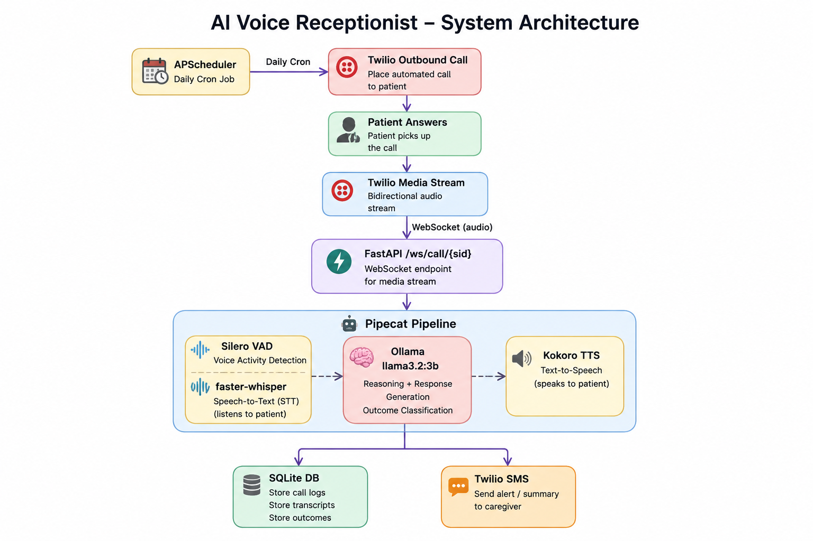

# ElderCare Medication Reminder — AI Voice Agent

[](https://github.com/codewithmuh/ai-voice-agent)
[](LICENSE)


An AI-powered outbound voice agent that calls elderly patients daily to remind them to take their medications. When a patient needs help or doesn't answer, their caregiver is automatically notified by SMS.

Runs entirely on your own machine — no cloud AI costs, no proprietary voice APIs.

## What It Does

- Places outbound phone calls to patients at their scheduled time (timezone-aware)
- Speaks a warm, personalised medication reminder using local TTS
- Listens to the patient's response using local speech recognition
- Classifies the outcome: took it / not yet / needs help / no answer
- Texts the caregiver automatically if the patient needs help or doesn't answer
- Logs every call with full transcript to a local database
- Provides a web dashboard to monitor compliance and manage patients

## Tech Stack

| Component | Role |
|-----------|------|
| **FastAPI** | Web server — HTTP routes, WebSocket bridge, Jinja2 dashboard |
| **Pipecat** | Voice pipeline — connects STT → LLM → TTS in a streaming pipeline |
| **Ollama (llama3.2:3b)** | Local LLM — generates warm, context-aware responses |
| **Kokoro TTS** | Local text-to-speech — natural-sounding voice, runs on CPU |
| **faster-whisper** | Local speech recognition — transcribes patient responses |
| **Silero VAD** | Voice activity detection — knows when patient starts/stops speaking |
| **Twilio** | Outbound phone calls + caregiver SMS |
| **APScheduler** | Timezone-aware daily cron jobs per patient |
| **SQLite + SQLAlchemy** | Stores patients, call logs, and transcripts |

## Architecture

All AI runs locally. Twilio handles only the phone network. No data leaves your machine.



### Call Flow

1. APScheduler fires at patient's call time in their local timezone
2. Twilio dials the patient's phone number
3. On answer, Twilio streams audio to the FastAPI WebSocket
4. Pipecat reads the initial Twilio handshake, extracts the stream SID
5. Silero VAD detects when the patient speaks, Whisper transcribes it
6. Ollama generates a caring response and eventually classifies the outcome
7. Kokoro TTS synthesises the reply and streams it back through Twilio
8. Conversation continues until a clear outcome is reached
9. Call ends — transcript and outcome saved to SQLite
10. If outcome is `needs_help` or `no_answer`, caregiver SMS fires in a background thread


### Key Routes

| Route | Method | Purpose |
|-------|--------|---------|
| `/` | GET | Dashboard — compliance stats + recent 10 calls |
| `/patients` | GET | Patient list with last outcome |
| `/patients` | POST | Add a new patient |
| `/call/{patient_id}` | POST | Trigger an immediate test call |
| `/twiml` | GET/POST | Returns TwiML — fetched by Twilio when call connects |
| `/webhook/call` | POST | Twilio status callbacks (no-answer, failed, completed) |
| `/ws/call/{call_sid}` | WebSocket | Pipecat audio pipeline — streams audio to/from Twilio |

## Quick Start

### Prerequisites

- Python 3.10+
- [Ollama](https://ollama.ai) installed and running
- [ngrok](https://ngrok.com) free account for a public WebSocket URL
- Twilio account with a phone number

### 1. Set up the environment

```bash
cd ai-voice-agent
python -m venv venv
source venv/bin/activate
pip install -r requirements.txt
```

### 2. Pull the LLM

```bash
ollama pull llama3.2:3b
```

### 3. Configure environment variables

```bash
cp .env.example .env
```

Edit `.env`:

```
TWILIO_ACCOUNT_SID=ACxxxxxxxxxxxxxxxxxxxxxxxxxxxxxxxx
TWILIO_AUTH_TOKEN=your_auth_token
TWILIO_PHONE_NUMBER=+1xxxxxxxxxx

OLLAMA_BASE_URL=http://localhost:11434/v1
OLLAMA_MODEL=llama3.2:3b

KOKORO_VOICE=af_sarah

NGROK_URL=https://xxxx.ngrok-free.app

DATABASE_URL=sqlite:///./demo.db
```

**Where to get credentials:**
- **Twilio:** [console.twilio.com](https://console.twilio.com) — Account SID and Auth Token on the homepage
- **ngrok:** [ngrok.com](https://ngrok.com) — free account, `brew install ngrok` on macOS

### 4. Start ngrok

```bash
ngrok http 8080
```

Copy the `https://xxxx.ngrok-free.app` URL into `.env` as `NGROK_URL`.

### 5. Seed demo patients

```bash
python seed.py
```

Creates 3 patients in different timezones. Edit `seed.py` to use your own phone number for testing.

### 6. Start the server

```bash
# Terminal 1
ollama serve

# Terminal 2
uvicorn main:app --port 8080
```

### 7. Open the dashboard

```
http://localhost:8080
```

Go to **Patients**, click **Trigger Test Call** on any row. Your phone will ring.

## Patient Outcomes

| Outcome | Meaning | Caregiver SMS |
|---------|---------|---------------|
| `took_it` | Patient confirmed they took medication | No |
| `not_yet` | Patient hasn't taken it yet | No |
| `needs_help` | Patient is confused or in distress | Yes |
| `no_answer` | Call unanswered or failed | Yes |

## Adding Patients

Use the web form at `/patients`. Required fields:

| Field | Example | Notes |
|-------|---------|-------|
| Name | Margaret van der Berg | Used in the personalised greeting |
| Phone | +1XXXXXXXXX | E.164 format |
| Timezone | Asia/Kolkata | IANA timezone string |
| Call Time | 09:00 | HH:MM in the patient's local timezone |
| Medication | Metformin | Spoken aloud in the reminder |
| Dosage | 500mg | Spoken aloud in the reminder |
| Caregiver phone | +919999999999 | Receives SMS on needs_help or no_answer |

## Kokoro Voice Options

The default voice is `af_sarah`. Other available voices:

```
af_alloy  af_aoede  af_bella  af_heart  af_jessica
af_kore   af_nicole af_nova   af_river  af_sarah
```

Change `KOKORO_VOICE` in `.env` to switch.

## Notes

- **Twilio trial accounts** play a disclaimer before your agent speaks — upgrade the account to remove it
- **ngrok free tier** URLs change on every restart — update `NGROK_URL` in `.env` and restart the server when this happens
- **Kokoro and Whisper models** download automatically on first run (a few hundred MB, cached locally after that)
- All AI inference is local — patient conversations are never sent to any external service

## License

MIT
